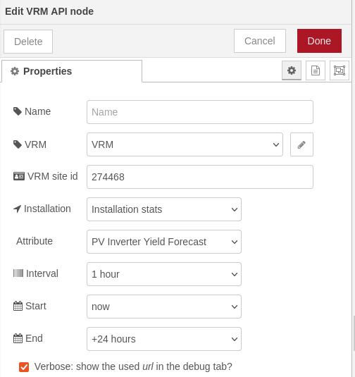

This node makes it easy to use the VRM API for data retrieval. Though not all 
possible API calls have been implemented, it can be used for retrieving and
creating alarms and fetching installations statistics. It can also be used to
retrieve the solar forecast data.

In order to allow the node to query your site, an
[access-token](https://vrm.victronenergy.com/access-tokens) needs to be created
and filled out in the configuration node.

## Inputs

* payload (`string|number|json`) - the trigger to query the VRM API

## Outputs

* payload (`json`) : the VRM answer

The output of the answer depends on the selected configuration. See the [VRM API documentation](https://vrm-api-docs.victronenergy.com/#)
in case you need assistance with interpreting the output.

### Configuration

: Name (string) : The name of the node
: VRM (config) : The configuration node
: VRM site id (number) : The site to query
: Installation (string) : The query type
: Verbose (boolean) : Show the used _url_ in the debug tab?

In case of installation `stats` there appear some extra configuration options
: Attribute (string) : Which attribute to fetch
: Interval (string) : Time between retrieved data points
: Start (integer) : Timestamp from which to fetch data
: End (integer) : Timestamp to which to fetch data

## Examples

There are several examples included in the package. In order to use them, import them via the
victron-vrm-api examples dropdown on the _Import nodes_ page (accessible via
the menu or by pressing _ctrl-i_).

## References

Please use either the issues on the GitHub site or the Node-RED space on our community for questions, troubleshooting and suggestions.
- [GitHub](https://github.com/dirkjanfaber/victron-vrm-api) - The nodes GitHub repository.
- [Community](https://community.victronenergy.com/smart-spaces/71/node-red.html) - Node-RED space in the Victron Energy community.
- [VRM API documentation](https://vrm-api-docs.victronenergy.com/#) - The VRM API documentation.

